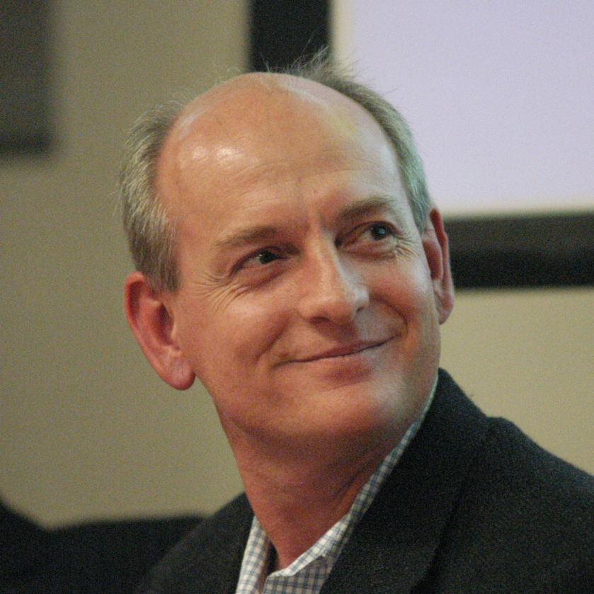
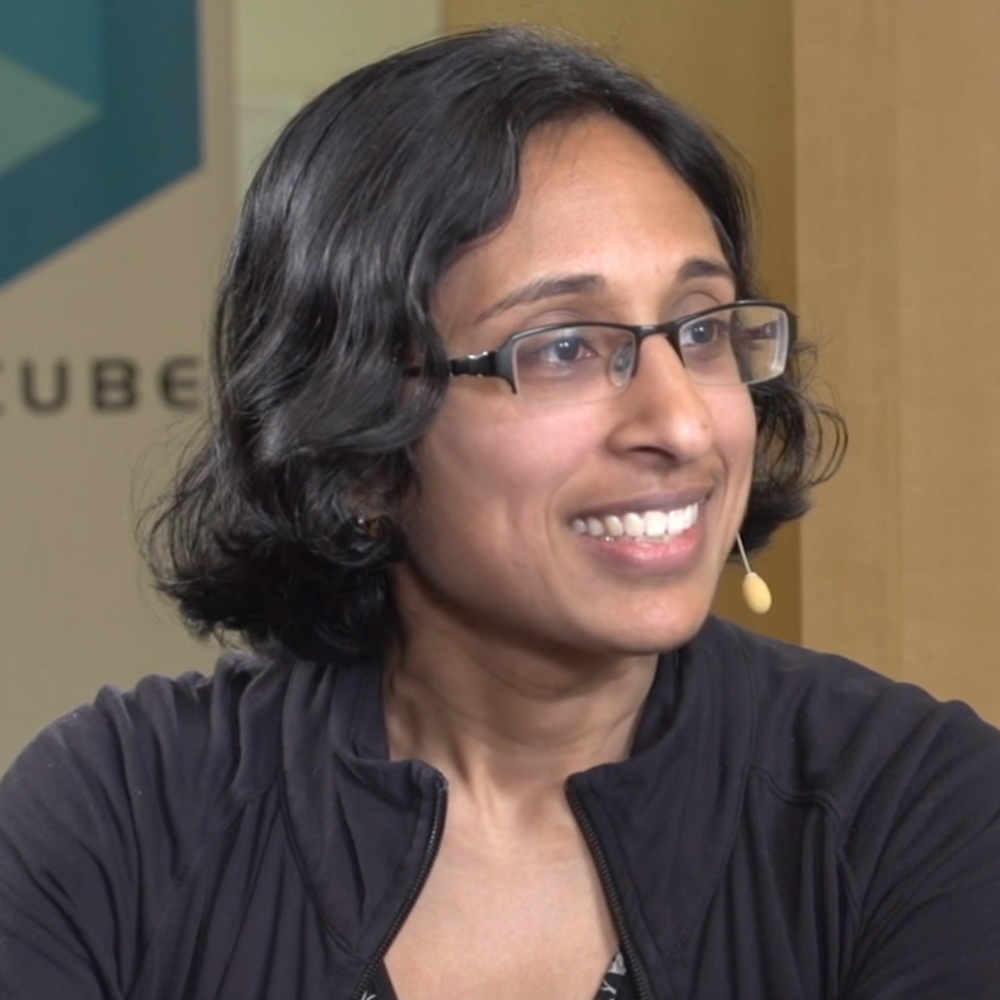
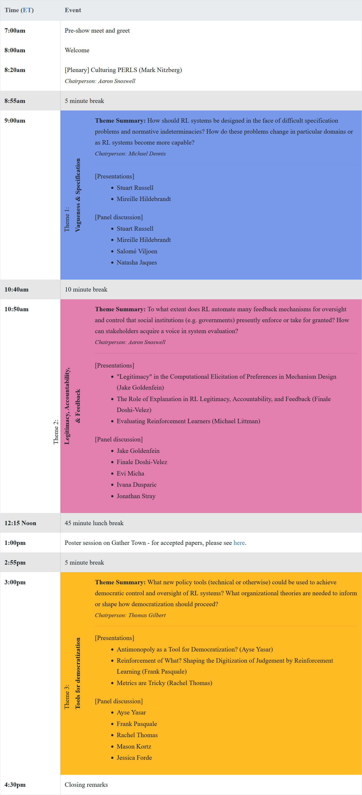

You are viewing the archive of the 2021 PERLS workshop, which was held on Tuesday, December 14th 2021 as part of the NeurIPS conference

<h1 id="overview">Overview</h1>

Sponsored by the Center for Human-Compatible AI at UC Berkeley, and with support from the Simons Institute and the Center for Long-Term Cybersecurity, we are convening a cross-disciplinary group of researchers to examine the near-term policy concerns of Reinforcement Learning (RL).
RL is a rapidly growing branch of AI research, with the capacity to learn to exploit our dynamic behavior in real time.
From YouTube’s recommendation algorithm to post-surgery opioid prescriptions, RL algorithms are poised to permeate our daily lives.
The ability of the RL system to tease out behavioral responses, and the human experimentation inherent to its learning, motivate a range of crucial policy questions about RL’s societal implications that are distinct from those addressed in the literature on other branches of Machine Learning (ML).

We began addressing these issues as part of the <a href="https://simons.berkeley.edu/news/mapping-political-economy-reinforcement-learning-systems-case-autonomous-vehicles">2020 Simons Institute program on the Theory of Reinforcement Learning</a>, and throughout 2020/21 we have been broadening the discussion through an <a href="https://geesegraduates.org/2020/10/26/political-economy-of-reinforcement-learning/">ongoing reading group</a>, including perspectives from Law and Policy.
The aim of this workshop will be to establish a common language around the state of the art of RL across key societal domains.
From this examination, we hope to identify specific interpretive gaps that can be elaborated or filled by members of our community.
Our ultimate goal will be to map near-term societal concerns and indicate possible cross-disciplinary avenues towards addressing them.

<h1 id="call-for-papers">Call for Papers</h1>

We are inviting papers from the fields of computer science, governance, law, economics, and game theory within the following research tracks:

<ol>
    <li style="margin-bottom: 15pt;">
    <b>Vagueness and specification.</b>
    RL methods require a specification of actions, observations, and rewards which condense vague real-world systems into a form suitable for our algorithms.  However, this specification makes impactful choices which give an underlying sense of normative indeterminacy -- the lack of prior standards or guidelines for how a given system ought to perform in simulation or post-deployment. Technical and policy discussions related to optimization and control often fail to address this more basic, irreducibly sociotechnical problem. The saliency of vagueness is likely to increase as RL capabilities expand, allowing designers to intervene at scales that were previously inaccessible even to governments and corporations. The following questions seem in scope: How might designers make sense of emergent system behaviors that are difficult to evaluate? Whose expertise or judgment is needed to better evaluate such behaviors either within or across domains? In what ways and contexts can the task of RL specification actually help refine the understanding of a given problem domain?
    </li>
    <li style="margin-bottom: 15pt;">
    <b>Legitimacy, Accountability, and Feedback.</b>
    The maturation of RL naturally raises questions about who should have the ability to oversee these systems and evaluate performance over time. In terms of how an agent learns to navigate a given environment proficiently, RL may in fact automate many feedback mechanisms for oversight and control that governmental institutions presently enforce or take for granted. Such determinations lie at the heart of modern conceptions of political sovereignty. We ask: How might preferred optimization techniques bear on existing normative concerns (e.g. data privacy)? To what extent do stakeholders have a voice in system evaluation? How can choices about how to structure computation be brought into alignment with legal conceptions of rights and duties?
    </li>
    <li style="margin-bottom: 15pt;">
    <b>Tools for democratization.</b>
    There is growing concern that the successful and safe integration of advanced AI systems into human societies will require democratic control and oversight of those systems themselves. At present there are many proposed standards, guidelines, laws, governance mechanisms, and regulations that could be leveraged to enact such democratization, as well as organizational theories (e.g. distributed expertise) that suggest how it should proceed. But it remains unclear what forms of inquiry, evaluation, and control are warranted or ought to be prioritized to deal with the challenges of RL in particular domains. We invite papers that propose new policy tools (technical or otherwise) in the context of RL, as well as explicitly normative contributions to the ongoing debate about what is at stake in democratization.
    </li>
</ol>

We encourage a broad interpretation of the problem spaces outlined in this call, and would urge researchers broadly interested in the topic of RL and society to consider submitting a contribution, even if it does not explicitly fall within the topics proposed above.

<h1 id="accepted-papers">Accepted Papers</h1>

This year we had six paper submissions, of which five were accepted for poster presentations during the workshop.
You can download a bibtex file for all accepted papers <a href="assets\bib\perls-2021-accepted.bib">here</a>.

The accepted papers are listed below in alphabetical order of the first author’s surname.

<!-- Bibliography generated using Zotero from .bib file in AMA format -->

<ul>
  <li>
    
Chapman, M., Scoville, C., &amp; Boettiger, C. (2021). <a href="https://openreview.net/forum?id=6OnoKEFVD_G">Power and Accountability in RL-driven Environmental Policy</a>. Workshop on the Political Economy of Reinforcement Learning Systems. Neural Information Processing Systems. <code class="language-plaintext highlighter-rouge">https://openreview.net/forum?id=6OnoKEFVD_G</code>

  </li>
  <li>
    
Chong, A. (2021). <a href="https://openreview.net/forum?id=KB5Kv85Mzg1">Deciding What’s Fair: Challenges of Applying Reinforcement Learning in Online Marketplaces</a>. Workshop on the Political Economy of Reinforcement Learning Systems. Neural Information Processing Systems. <code class="language-plaintext highlighter-rouge">https://openreview.net/forum?id=KB5Kv85Mzg1</code>

  </li>
  <li>
    
Eschenbaum, N., &amp; Zahn, P. (2021). <a href="https://openreview.net/forum?id=BztUFukcBry">Robust Algorithmic Collusion</a>. Workshop on the Political Economy of Reinforcement Learning Systems. Neural Information Processing Systems. <code class="language-plaintext highlighter-rouge">https://openreview.net/forum?id=BztUFukcBry</code>

  </li>
  <li>
    
Holtman, K. (2021). <a href="https://openreview.net/forum?id=bFuvcB4IeQO">Demanding and Designing Aligned Cognitive Architectures</a>. Workshop on the Political Economy of Reinforcement Learning Systems. Neural Information Processing Systems. <code class="language-plaintext highlighter-rouge">https://openreview.net/forum?id=bFuvcB4IeQO</code>

  </li>
  <li>
    
Hu, Y., Zhu, Z., Song, S., Liu, X., &amp; Yu, Y. (2021). <a href="https://openreview.net/forum?id=qNAeKJKftJy">Calculus of Consent via MARL: Legitimating the Collaborative Governance Supplying Public Goods</a>. Workshop on the Political Economy of Reinforcement Learning Systems. Neural Information Processing Systems. <code class="language-plaintext highlighter-rouge">https://openreview.net/forum?id=qNAeKJKftJy</code>

  </li>
</ul>

<h1 id="confirmed-speakers-and-panelists">Confirmed speakers and panelists</h1>

    
  

    
    

    <a href="https://people.eecs.berkeley.edu/~russell/" target="_blank">
      Stuart Russell
    </a>
    

    

      Professor of Computer Science at the University of California and author of "Artificial Intelligence: A Modern Approach"
    

  

  

    
    

    <a href="https://www.linkedin.com/in/nitzberg/" target="_blank">
      Mark Nitzberg
    </a>
    

    

      Executive Director, CHAI Berkeley
    

  

  

    
    

    <a href="https://research.google/people/NatashaJaques/" target="_blank">
      Natasha Jaques
    </a>
    

    

      Research Scientist at Google Brain, Post-doc at UC Berkeley
    

  

  

    
    

    <a href="https://www.brooklaw.edu/Contact-Us/Pasquale-Frank" target="_blank">
      Frank Pasquale
    </a>
    

    

      Professor of Law, Brooklyn Law School
    

  

  

    
    

    <a href="https://jzf2101.github.io/" target="_blank">
      Jessica Forde
    </a>
    

    

      PhD Student, Brown University
    

  

  

    
    

    <a href="https://www.littmania.com/" target="_blank">
      Michael Littman
    </a>
    

    

      Royce Family Professor of Teaching Excellence in Computer Science, Brown University
    

  

  

    
    

    <a href="https://lsts.research.vub.be/en/mireille-hildebrandt/" target="_blank">
      Mireille Hildebrandt
    </a>
    

    

      Tenured Research Professor on Interfacing Law and Technology
    

  

  

    
    

    <a href="http://jonathanstray.com/me" target="_blank">
      Jonathan Stray
    </a>
    

    

      Visiting Scholar, Berkeley CHAI
    

  

  

    
    

    <a href="https://www.salomeviljoen.com/" target="_blank">
      Salomé Viljoen
    </a>
    

    

      Academic Fellow and Lecturer in Law, Columbia Law School
    

  

  

    
    

    <a href="https://law.unimelb.edu.au/about/staff/jake-goldenfein" target="_blank">
      Jake Goldenfein
    </a>
    

    

      Senior Lecturer, Melbourne Law School
    

  

  

    
    

    <a href="https://www.scss.tcd.ie/Ivana.Dusparic/" target="_blank">
      Ivana Dusparic
    </a>
    

    

      Ussher Assistant Professor in Future Cities and the Internet of Things, Trinity College Dublin
    

  

  

    
    

    <a href="https://www.hks.harvard.edu/about/finale-doshi-velez" target="_blank">
      Finale Doshi-Velez
    </a>
    

    

      John L. Loeb associate professor in Computer Science at the Harvard Paulson School of Engineering and Applied Sciences
    

  

  

    
    

    <a href="https://rachel.fast.ai/" target="_blank">
      Rachel Thomas
    </a>
    

    

      Founder of Centre for Applied Data Ethics at University of San Francisco, co-founder of fast.ai
    

  

  

    
    

    <a href="https://cyber.harvard.edu/people/mkortz" target="_blank">
      Mason Kortz
    </a>
    

    

      Clinical instructor, Harvard Law School Cyberlaw Clinic
    

  

  

    
    

    <a href="http://www.cs.toronto.edu/~emicha/" target="_blank">
      Evi Micha
    </a>
    

    

      Postgraduate Affiliate, Vector Institute for Artificial Intelligence
    

  

  

    
    

    <a href="https://www.sciencespo.fr/ecole-de-droit/en/profile/gizem-yasar-ayse.html" target="_blank">
      Ayse Gizem Yasar
    </a>
    

    

      PhD Candidate, Sciences Po Law School
    

  

    

<h1 id="schedule">Schedule</h1>

